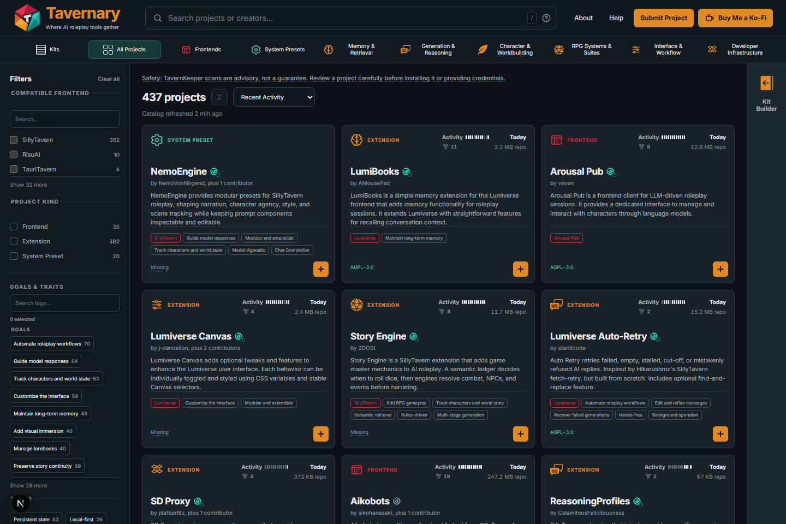
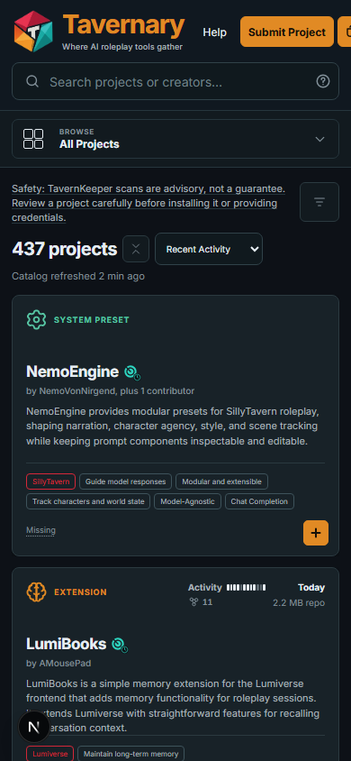

# Tavernary

Tavernary is a living, searchable catalog of projects for AI roleplay. It
helps you discover projects, understand what they do, and find the creator's
source page.



_The catalog is a map of projects. The project itself still lives with its
creator._

## Start here

- [What is Tavernary?](docs/guides/what-is-tavernary.md) — a quick explanation
  of the catalog and its boundaries.
- [Getting started](docs/guides/getting-started.md) — find a project in a few
  minutes.
- [Using the catalog](docs/guides/using-the-catalog.md) — search, filters,
  activity labels, and scan notes.
- [Kits](docs/guides/kits.md) — browse and build helpful collections.
- [Getting help](docs/guides/getting-help.md) — choose the right help path.
- [Words to know](docs/guides/words-to-know.md) — friendly definitions for
  catalog words.

## What you can do here

Tavernary is made for small, useful choices:

1. Search for something you want to try.
2. Compare the information shown on project cards.
3. Open the creator's source page and read its instructions.
4. Decide for yourself whether it is a good fit.
5. Save projects into a Kit when you want a handy collection to revisit.

On a phone, the same catalog fits into a smaller screen:



## A quick note about safety

Some projects have TavernKeeper scan information. TavernKeeper combines
deterministic open-source security tools with contextual review of the hits.
That information is meant to help you ask better questions. It is not a
guarantee, a safety certificate, or an endorsement.

Read the project's own instructions and source before you install anything,
run code, or give it access to personal information. Strong warning colors are
used sparingly because a warning should mean “please look more closely,” not
“this project is inconvenient.”

## Bounding the Problem

Tavernary is growing, but it is still small. Most people who use SillyTavern
have never heard of it. With limited time and resources, the project needs a
clear fence around its job. Without that fence, a catalog could slowly turn
into an app store, code host, review board, support desk, or social network.

The focused problem is simpler: help people find a project, understand what it
does, compare the information available, and reach the creator's source.
Tavernary is a living map of public project information. Tavernary Companion
is a connected extension manager for people who want help managing extensions
inside SillyTavern. Companion can make the next step easier, but Tavernary
does not own every project in the catalog.

This boundary also protects trust. A card may combine information written by a
creator, facts observed from a repository, and explanations produced by
Tavernary's tools. A scan can add useful evidence, but it cannot decide
whether a project is “good.” If every ordinary issue receives a scary label,
people stop noticing the cases that deserve real care. The goal is to show the
evidence honestly and keep strong warnings meaningful.

That gives Tavernary a direction: make discovery clearer, make evidence easier
to understand, and help people choose their next step without pretending to
speak for creators or solve every neighboring problem. If a feature belongs in
Companion, GitHub, a creator's own repository, or another community space,
Tavernary should let it stay there.

### What Tavernary is not

Tavernary is not a file host, registry, code host, marketplace, publishing
platform, blog, forum, or social network. It does not copy project files,
decide which projects are “good,” or replace a project's own support channel.

## Help people make sense of the catalog

The public guides live in [the documentation hub](docs/README.md). Contributors
can start with the [contribution overview](docs/contributing/contribution-overview.md)
and [development setup](docs/contributing/development-setup.md).

## Run Tavernary locally

This repository contains the catalog data, the static Next.js site, submission
forms, and the automation that publishes the site. For technical setup and
verification, use [Development setup](docs/contributing/development-setup.md).

The **Submit Project** link opens Tavernary's static submission builder. It
creates a review request; it does not host the submitted files. Frontends and
Extensions require a public GitHub or Codeberg repository.

Frontends and Extensions require a public GitHub or Codeberg repository.

No account, database service, or
runtime API is required to browse the catalog.

The short version is:

```powershell
npm ci
npm run dev
```

The main verification command is:

```powershell
npm run check
```

The site is static and GitHub-native. It links to projects hosted by their
creators; it does not host or redistribute their files.
