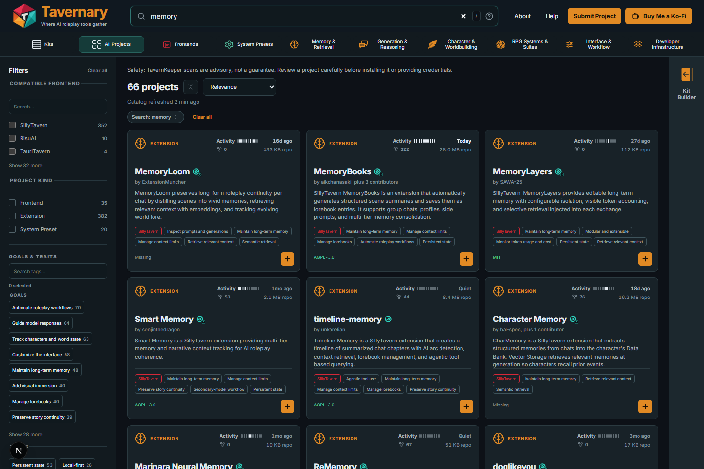

# Tavernary documentation

Welcome! These pages explain Tavernary in plain language first. Start with a
picture and a short guide, then open the more detailed pages when you want to
learn more.

## For players and visitors

- [What is Tavernary?](guides/what-is-tavernary.md) — the big picture and the
  important boundaries.
- [Getting started](guides/getting-started.md) — find your first project.
- [Using the catalog](guides/using-the-catalog.md) — search, compare cards,
  and understand the labels.
- [Kits](guides/kits.md) — collect projects into a list you can revisit.
- [Getting help](guides/getting-help.md) — report a problem or find the right
  support place.
- [Words to know](guides/words-to-know.md) — a tiny dictionary for Tavernary.

## For people who make projects

- [Contribution overview](contributing/contribution-overview.md) — choose the
  right way to update a listing, report a problem, or submit a project.
- [Submission and review](contributing/submission-and-review.md) — what happens
  after a project is submitted.
- [Kits: contributor rules](contributing/kits.md) — how community collections
  are checked and published.

## For contributors

- [Development setup](contributing/development-setup.md) — run the site and
  verification checks locally.
- [Architecture](architecture/system-overview.md) — how the static site and
  catalog layers fit together.
- [Reference](reference/) — schemas, vocabularies, manifests, and status
  labels.
- [Decision log](architecture/decision-log.md) — why important boundaries
  exist.

Technical pages use exact names and commands when precision matters. If a page
starts feeling too technical, return to the player guides above; they are the
best place to begin.

Historical project plans and design notes remain under
[`docs/superpowers/`](superpowers/).

## Policies

- [Licensing](../LICENSING.md)
- [Security policy](../SECURITY.md)
- [Trademark and brand policy](../TRADEMARKS.md)
