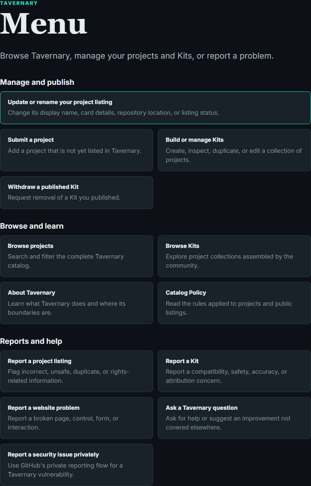

# Contribution overview

Thanks for helping Tavernary. The easiest way to contribute is to choose the
smallest path that matches your goal. Tavernary keeps project data, website
changes, Kits, and security reports on separate tracks so each one gets the
right kind of review.

## Choose a path

| You want to… | Start here |
| --- | --- |
| Add a project | [Submit a project](/submit/project/) |
| Fix a project card | [Report a project listing](/menu/report-project/) |
| Update your own project listing | [Update or rename your project listing](/menu/manage-project/) |
| Make or edit a Kit | [Open the Kit Builder](/?mode=kits) |
| Report a Kit | [Report a Kit](/menu/report-kit/) |
| Report a site problem | [Report a website problem](/menu/report-website/) |
| Ask another Tavernary question | [Get other help](/menu/other/) |
| Change code, tests, or docs | Open a pull request in this repository |
| Report a Tavernary security problem | Use the private path in [SECURITY.md](../../SECURITY.md) |

## Add a project

Use Tavernary's project form. It builds a structured review request and opens a
GitHub Issue Form as a public review mirror. Automation checks the source and
obvious duplicates, then prepares a pull request when the request is ready.

The source is still the important part. Frontends and Extensions need a public
GitHub or Codeberg repository. System Presets may use another stable public
HTTPS source page. Tavernary links to the source; it does not host the files.

Read [Submission and review](submission-and-review.md) for the complete flow.

External GitHub accounts may keep up to 10 open issues in Tavernary. The limit
covers all public issue types; edits and comments do not use another slot.
Closing an issue restores one slot immediately.

Validated requests appear in the catalog after their checks pass. An **Add
cards from this source** request is handled as one batch; individual cards do
not appear before the complete batch is accepted.

## Manage a listing

The owner path is for the current personal GitHub owner of a verified
repository. For an organization-owned repository, external source, or other
listing concern, use [Report a project listing](/menu/report-project/).

The owner form can:

- edit one card;
- **Add cards from this source**;
- update a repository location after a rename or transfer;
- **retire or restore a card**; or
- **permanently delist a source**.

An Add cards from this source request contains **one to ten cards** and there
can be only **one unresolved add-card request per source**. Retiring or
restoring a card is reversible. To permanently delist a source means removing
every associated card and stopping that source from returning through normal
self-service.

Cards and sources have different identities. A source owns the repository
location, immutable provider ID, refresh policy, and snapshots. A card owns its
title, kind, summary, tags, and listing state. A repository rename must update
the source record without changing card IDs.

## Make a Kit

Kits are ordered collections of 3–50 published project cards. Build or edit one
in Tavernary, review the draft, and submit it through the GitHub review mirror.
Do not hand-edit generated Kit output. See the [Kit contributor guide](kits.md).

## Improve the repository

For code, tests, styling, catalog scripts, workflows, or documentation:

1. Read the relevant project documentation.
2. Make a narrow, reviewable change.
3. Keep human-authored records, machine snapshots, and generated catalog output
   in their proper boundaries.
4. Run the checks in [Development setup](development-setup.md).
5. Open a pull request that explains what changed and how it was verified.

Do not hand-edit `src/generated/catalog.json`. Use the catalog build scripts and
inspect the generated diff instead.

## Report a problem

The [Menu](/menu/) takes you to the matching report form, where you can review a
report before it becomes a public GitHub issue. Ordinary reports must not
contain secrets, credentials, or private personal information. Tavernary does
not support third-party projects; send software-use questions to that project's
own repository or support channel.

For a vulnerability in Tavernary, use the private
`security/advisories/new` flow described in [SECURITY.md](../../SECURITY.md).

The public Catalog Policy permits consensual adult content, kink, fetish
content, and ordinary profanity. Use the listing report path when a published
card appears to conflict with that policy.

## A few good habits

- Include a source link or other evidence.
- Keep one issue focused on one goal.
- Return to Tavernary to correct a review draft instead of editing the GitHub
  mirror by hand.
- Do not treat automated scan or policy information as an endorsement.
- Use [Licensing](../../LICENSING.md) and [Trademark policy](../../TRADEMARKS.md)
  as part of your contribution checklist.
