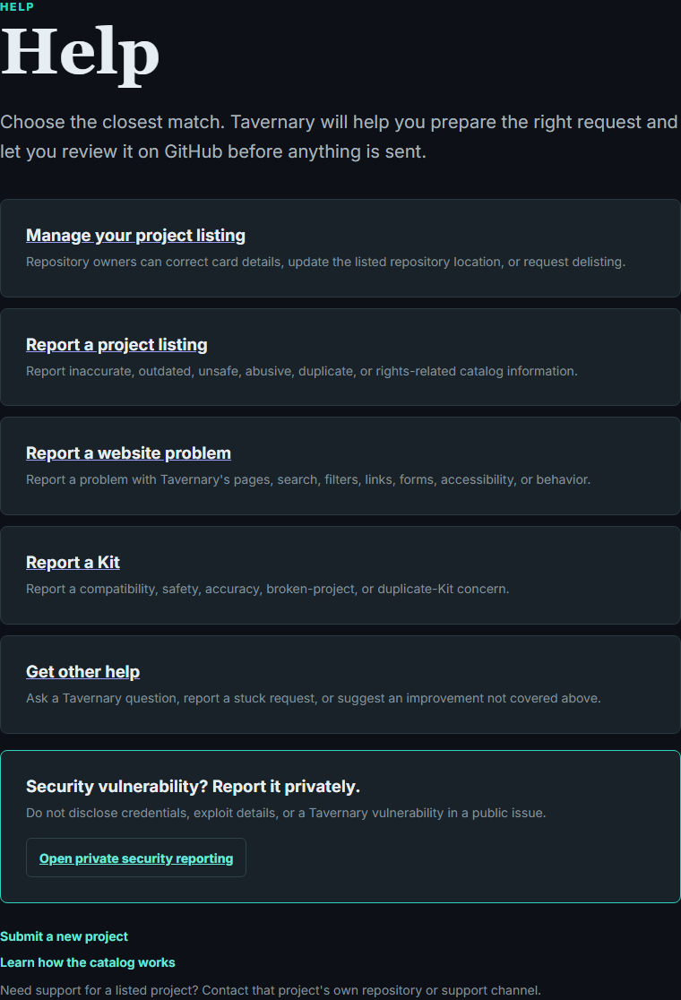
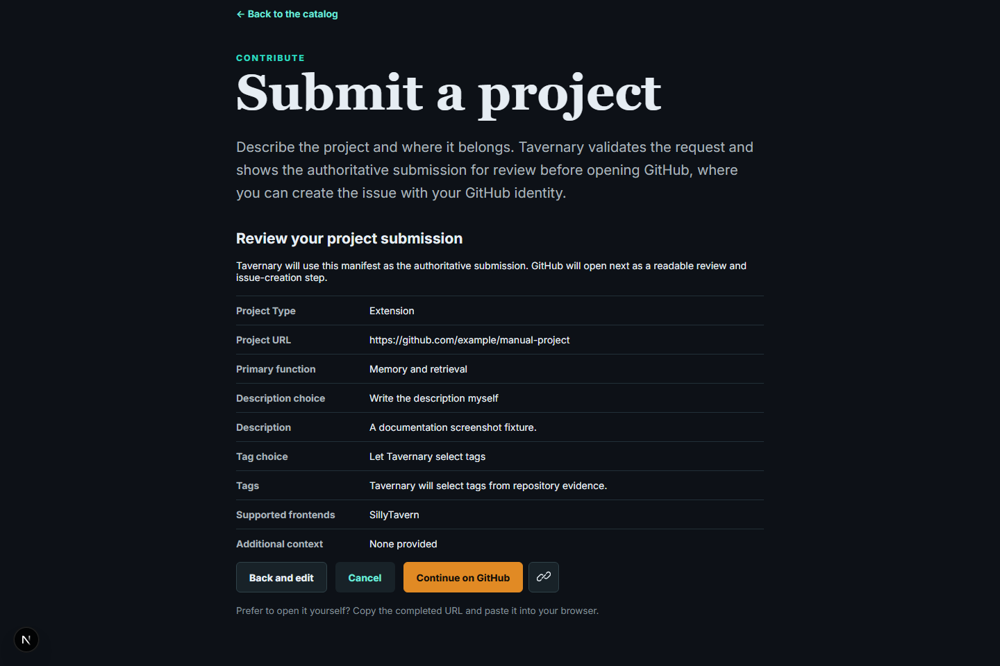

# Getting help

The [Help hub](/help/) helps you send a question to the right place. It keeps
project-listing questions separate from website problems and security reports.

## Choose a path

- **Manage your project listing** — for a verified owner or reviewed Tavernary
  maintainer who needs to update a listing.
- **Report a project listing** — for incorrect, unsafe, broken, or rights-related
  information on a project card.
- **Report a website problem** — for a broken page, search issue, layout bug,
  accessibility problem, or confusing handoff.
- **Report a Kit** — for a problem with a published Kit.
- **Get other help** — for a Tavernary question that does not fit the other
  paths.

## Before you send a report

Read the preview carefully. Ordinary reports become public GitHub issues, so
never include passwords, tokens, private personal information, or secret
security details. If you need to change something, go back to Tavernary and
make a new review.

Tavernary does not provide support for someone else's project. For help using
an extension, frontend, or preset, use that project's own repository or support
channel.

## Security problems

If you found a security vulnerability in Tavernary itself, use the private
[security help path](/help/security/) or the private GitHub security form. Do
not put vulnerability details in a public issue.

## What happens next

Tavernary uses GitHub as a public review mirror. Automation checks the request,
and a maintainer or the normal publication workflow handles the next step. A
report is not an automatic takedown, and a submission is not an automatic
endorsement.

For contributor details, see [Contribution overview](../contributing/contribution-overview.md).
