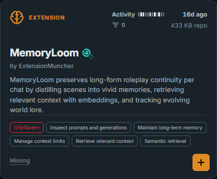

# Getting started

You can use Tavernary without an account. Start with a question like:

> “I want an extension that helps me do ____.”

## Your first five minutes

1. Open the [Tavernary catalog](../../).
2. Type a few words into the search box.
3. Look at the project cards that appear.
4. Open a card's source link and read the creator's instructions.
5. Decide whether the project fits what you want before you install or run it.

You do not need to understand every number on a card. Begin with the project
name, kind, summary, supported frontend, and source link. The other labels are
clues you can learn as you go.

## Search for an idea

Try words that describe your goal, such as `memory`, `characters`, `lore`, or
`preset`. You can add more words to make the search narrower. Use `+` between
search ideas when either idea should match, such as `memory+lore`.

## Check the source

Tavernary links to the creator's repository or source page. That is where you
should look for:

- installation steps;
- supported versions;
- permissions or settings the project needs;
- license information;
- recent updates; and
- a way to ask the creator for help.

Tavernary does not download or install the project for you. Keeping that step
with the creator's source makes it clearer which instructions and files you are
using.

## Read the clues carefully

Popularity and activity are not quality scores. A small new project may be a
great fit, and a famous project may not be right for you. Scan information is
also a clue, not a guarantee.

If a card says **Pending enrichment**, Tavernary is still waiting for a verified
source fact. Treat it as “we do not know this part yet,” not as a negative
answer.

For a guided tour of every card label, read [Using the catalog](using-the-catalog.md).
