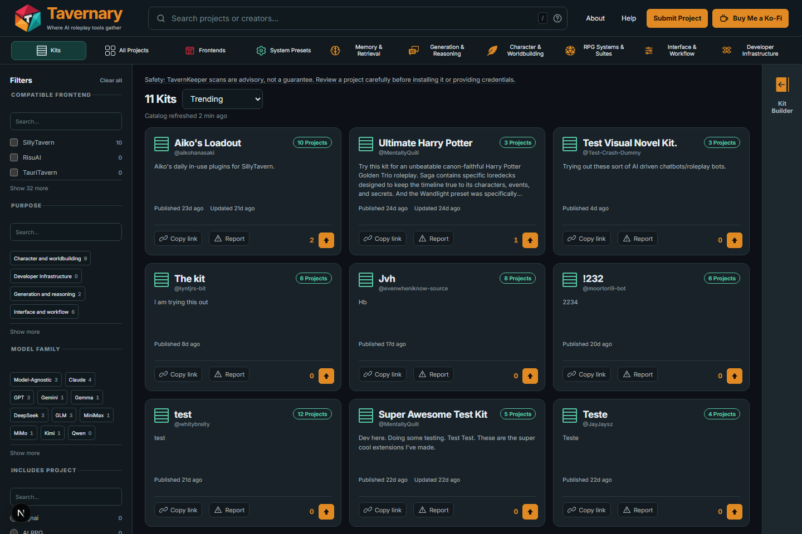
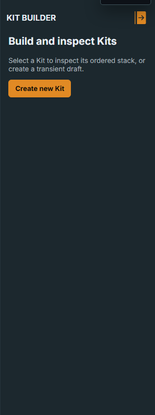

# Kits

A Kit is a community-made collection of Tavernary projects. Think of it like a
playlist or a packing list: it puts useful projects together so you can find
them again.

## What a Kit contains

- 3 to 50 projects already listed in Tavernary;
- an order chosen by the Kit author;
- a title and description explaining the collection; and
- links back to each project's own card and source.

A Kit does not copy project files or install anything. It is a helpful map of
related projects, not a bundle of software.

## Browse a Kit

Open a Kit and look at its project order and description. Then open the
individual project cards and read their source instructions. A Kit's theme can
help you choose where to look first, but you still decide what to use.

## Build or edit a Kit

1. Open the Kit Builder.
2. Add projects from the catalog.
3. Arrange them in the order that makes sense.
4. Add a clear title and description.
5. Review the whole Kit before sending it for GitHub review.

Drafts stay in your browser until you submit them. Tavernary checks the final
manifest, project count, duplicate entries, and content rules before a Kit can
be published.

New Kits and edits are reviewed through GitHub. A valid Kit can publish after
the automated checks pass. If something needs fixing, return to Tavernary,
correct the draft, and send a fresh review.

## What support means

Some Kits show support from eligible `+1` reactions on their source issue.
Support is a signal that people found the collection useful. It is not a star
rating, a quality score, or an official Tavernary endorsement.

## Report or withdraw a Kit

- Use [Report a Kit](/help/report-kit/) when a published collection has a
  problem.
- Use [Withdraw a Kit](/help/withdraw-kit/) when you are the recorded author
  and want to remove your Kit.

For the exact contributor rules, read [Kit submission and moderation](../contributing/kits.md).
